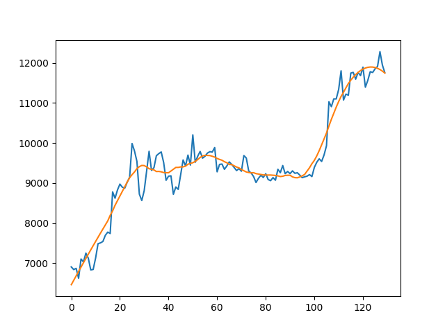

# Smooth Data
>:warning: Python 3.10.12

>:pencil: Andrea Ruo

## Description
This code allows you to approximate a sequence of points to a smooth function.

```python
import numpy as np
import pandas as pd
import matplotlib.pyplot as plt
from scipy.signal import savgol_filter    

# noisy data
yourdata = [6903.79, 6838.04, 6868.57, 6621.25, 7101.99, 7026.78, 7248.6, 7121.4, 6828.98, 6841.36, 7125.12, 7483.96, 7505.0, 7539.03, 7693.1, 7773.51, 7738.58, 8778.58, 8620.0, 8825.67, 8972.58, 8894.15, 8871.92, 9021.36, 9143.4, 9986.3, 9800.02, 9539.1, 8722.77, 8562.04, 8810.99, 9309.35, 9791.97, 9315.96, 9380.81, 9681.11, 9733.93, 9775.13, 9511.43, 9067.51, 9170.0, 9179.01, 8718.14, 8900.35, 8841.0, 9204.07, 9575.87, 9426.6, 9697.72, 9448.27, 10202.71, 9518.02, 9666.32, 9788.14, 9621.17, 9666.85, 9746.99, 9782.0, 9772.44, 9885.22, 9278.88, 9464.96, 9473.34, 9342.1, 9426.05, 9526.97, 9465.13, 9386.32, 9310.23, 9358.95, 9294.69, 9685.69, 9624.33, 9298.33, 9249.49, 9162.21, 9012.0, 9116.16, 9192.93, 9138.08, 9231.99, 9086.54, 9057.79, 9135.0, 9069.41, 9342.47, 9257.4, 9436.06, 9232.42, 9288.34, 9234.02, 9303.31, 9242.61, 9255.85, 9197.6, 9133.72, 9154.31, 9170.3, 9208.99, 9160.78, 9390.0, 9518.16, 9603.27, 9538.1, 9700.42, 9931.54, 11029.96, 10906.27, 11100.52, 11099.79, 11335.46, 11801.17, 11071.36, 11219.68, 11191.99, 11744.91, 11762.47, 11594.36, 11761.02, 11681.69, 11892.9, 11392.09, 11564.34, 11779.77, 11760.55, 11852.4, 11910.99, 12281.15, 11945.1, 11754.38]

# Dataframe definition
df = pd.DataFrame(dict(x=yourdata))
yourdata_filtered = df[["x"]].apply(savgol_filter,  window_length=31, polyorder=2)

plt.plot(yourdata)
plt.plot(yourdata_filtered)
plt.show()
```
Where:
- ``window_length``: The window_length parameter determines the length of the filter window. It represents the number of data points (samples) that are used to compute the smoothed value for each point in the input signal. Essentially, it sets the size of the moving window that slides over the data.
In the proposed code, ``window_length=31`` means that the filter considers a window of 31 data points at a time when performing the smoothing. This value should be chosen based on the characteristics of your data and the level of smoothing you want to achieve. A __larger window_length__ will provide more smoothing but might also remove some fine details from the signal. Conversely, a __smaller window_length__ will provide less smoothing and retain more details.
- ``polyorder``: The polyorder parameter specifies the order of the polynomial to fit to the data within each window. It defines the degree of the polynomial used in the least-squares fitting process that takes place during smoothing.
In the proposed code, ``polyorder=2`` indicates that a second-degree polynomial (a quadratic polynomial) is used for fitting within each window. The choice of polyorder determines the flexibility of the smoothing process. __Higher values of polyorder__ allow the filter to capture more complex variations in the data but may also introduce more oscillations in the smoothed signal. A __polyorder of 0__ corresponds to a moving average (no polynomial fitting), while __polyorder of 1__ corresponds to linear interpolation.

Below is shown the plot of the noisy data and the smoothed data:

